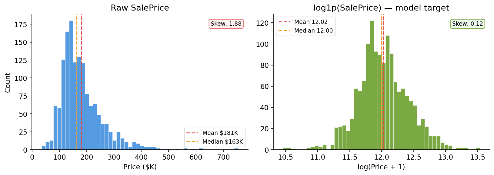
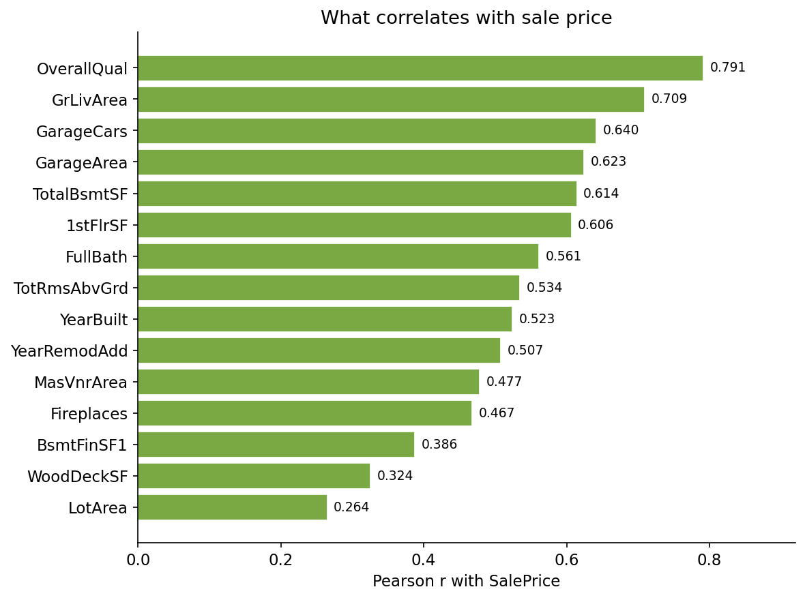
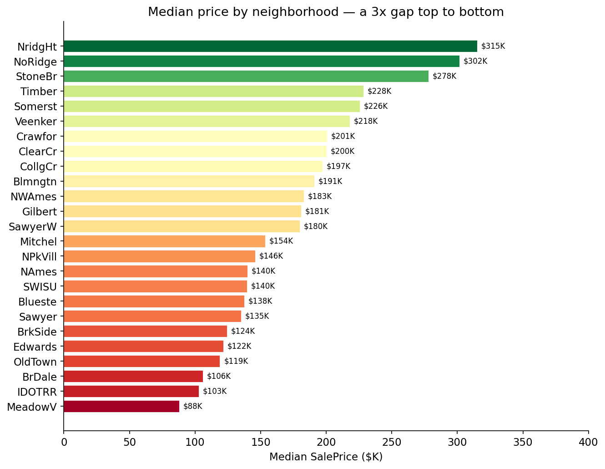

# House Price Prediction — End-to-End ML Pipeline


[](https://github.com/Sourabh1710/house-price-mlops/actions)

> **What's this house actually worth - and can a machine prove it, live, right now?**
> An end-to-end ML system that prices Iowa homes from 79 raw listing features, compares four models honestly with MLflow, and ships through a fully automated CI/CD pipeline to a live API — not a notebook that only runs on my machine.

[Live API ->](https://house-price-api-latest-kmxu.onrender.com/docs) &nbsp;|&nbsp; [What Drives Price ↓](#what-drives-price) &nbsp;|&nbsp; [Results ↓](#results)

---

## The Problem

A professional home appraisal costs hundreds of dollars and takes days. An agent pricing a listing 10% too high can watch it sit unsold for weeks; pricing it 10% too low leaves the seller's money on the table. That gap between "what a house is worth" and "what someone guesses it's worth" is exactly why automated valuation models exist at companies like Zillow — and exactly the problem this project is built to solve at a smaller scale: turn 79 raw features about a house into a defensible price estimate, instantly, through an API anyone can call.

The dataset is real home sales from Ames, Iowa — 1,460 houses with known prices, 79 features ranging from square footage to roof material.


*Raw sale price is heavily right-skewed (skew = 1.88) — a handful of expensive houses drag the tail. Log-transforming the target (skew drops to 0.12) is the single most impactful preprocessing decision in this project; see [Technical Approach](#technical-approach) for why.*

---

## Results

Tracked with MLflow across four models, scored by 5-fold cross-validated RMSLE (the same metric Kaggle uses for this exact competition) on the log-transformed target.

| Model | CV RMSLE | Notes |
|---|---|---|
| **LinearRegression** | 753026897.8747395 | Baseline, no regularization |
| **Ridge** | 0.13916191546903675 | Best linear model |
| **XGBoost** | 0.1209480622904863 | Gradient boosted trees |
| **LightGBM** | 0.1284309591618807 | 


**Proof it actually works, end to end:** a default 2-story, 2005-built house in the College Creek neighborhood (`OverallQual=8`, `GrLivArea=2000`) returns a live prediction of **$212949.7** from the deployed API - not a notebook output, an actual HTTP response from `https://house-price-api-latest-kmxu.onrender.com/predict`.

---

## What Drives Price

Standard correlation analysis against `SalePrice`, computed directly from the training data:

**1. Overall Quality (r = 0.79)** - by far the strongest single signal. This is a human expert's composite 1–10 rating of materials and finish, which makes intuitive sense: it's already doing some of the model's work for it.

**2. Above-grade living area (r = 0.71)** - square footage matters, unsurprisingly, but it's a weaker signal than quality alone. A small, beautifully finished house can outprice a larger, average one.

**3. Garage capacity (r = 0.64)** - how many cars the garage fits correlates more strongly with price than the garage's square footage does, suggesting buyers value capacity as a discrete feature, not just raw space.

**4. Neighborhood — a 3.58x gap.** Median price ranges from **$88,000** in Meadow Village to **$315,000** in Northridge Heights. Two houses with identical specs can differ in value by more than three times purely on location.


*Pearson correlation of the top 15 numeric features against SalePrice. All positive — bigger and better consistently means more expensive, with quality dominating square footage.*


*Median sale price by neighborhood. This is exactly why `Neighborhood` is one-hot-encoded rather than dropped — location alone explains a 3.5x swing in value.*

---

## Technical Approach

### Why these specific choices

**I wrapped the preprocessor and model in one sklearn Pipeline.** If I'd fit the scaler or imputer before cross-validation, I'd leak validation-fold statistics into training — a dishonest score. Keeping both steps inside one Pipeline means the preprocessor re-fits fresh on each CV fold's training split, so the numbers in the Results table above are actually trustworthy.

**I log-transformed the target with `np.log1p`.** As the skew numbers above show (1.88 → 0.12), this turns a heavily right-skewed target into something close to normal, which measurably improves every model — not just the linear ones. I apply `np.expm1` at prediction time so the API always returns plain dollar amounts.

**I set `handle_unknown='ignore'` on the OneHotEncoder.** The test set contains neighborhood and sale-type categories the training data never saw. Rather than let the pipeline crash on an unfamiliar value, unseen categories silently become all-zero rows — and I wrote a test that injects a fake "ATLANTIS_NEIGHBORHOOD" category to confirm this actually works, not just that it should.

**I retrain the model fresh inside CI, rather than committing the `.pkl` file to git.** Binary artifacts don't belong in git history. Training fresh on every push also guarantees the model that gets deployed was actually built from the exact code in that commit — not an older file that happened to still be lying around.

**I split a separate `requirements-serve.txt` from the full `requirements.txt`.** The deployed API never imports MLflow, pytest, or httpx — those are training/testing-only tools. Installing the full requirements list into the Docker image was bloating one layer past 600MB and causing push failures; splitting them cut the image down to only what the API actually uses at runtime.

---

## Stack

| Layer | Tools |
|---|---|
| Data & EDA | pandas, numpy, matplotlib |
| Preprocessing | scikit-learn (Pipeline, ColumnTransformer, SimpleImputer, StandardScaler, OneHotEncoder) |
| Models | scikit-learn (LinearRegression, Ridge), XGBoost, LightGBM |
| Experiment tracking | MLflow |
| Model persistence | joblib |
| API | FastAPI + Pydantic |
| Containerization | Docker (multi-stage build) |
| CI/CD | GitHub Actions |
| Deployment | Render |

---

## Quickstart

```bash
git clone https://github.com/Sourabh1710/house-price-mlops
cd house-price-mlops

pip install -r requirements.txt

# Train all 4 models with MLflow tracking (~7-8 min, mostly LightGBM)
python src/train.py
mlflow ui          # → localhost:5000 to compare runs

# Launch the API
uvicorn src.app:app --reload   # → localhost:8000/docs
```

```bash
# Run the test suite
pytest tests/ --cov=src -v

# Build and run the production Docker image
docker build -t house-price-api .
docker run -p 8000:8000 house-price-api
```

---

## Project Structure

```
├── src/
│   ├── features.py        ← ColumnTransformer pipeline — fit-only-on-train
│   ├── train.py            ← MLflow tracking across 4 models
│   └── app.py               ← FastAPI: /predict  /health  /docs
├── tests/
│   └── test_pipeline.py    ← leakage, NaN handling, API response tests
├── notebooks/
│   └── 01_eda.ipynb         ← the analysis behind every plot in this README
├── .github/workflows/
│   └── ci-cd.yml             ← test → train → build → push → deploy, on every push
├── Dockerfile                ← multi-stage build
├── requirements.txt          ← full deps (training + testing)
├── requirements-serve.txt    ← slim deps (API only)
└── render.yaml
```

---

*Dataset: [House Prices — Advanced Regression Techniques, Kaggle](https://www.kaggle.com/c/house-prices-advanced-regression-techniques) · Ames, Iowa · 1,460 rows · 79 features*
